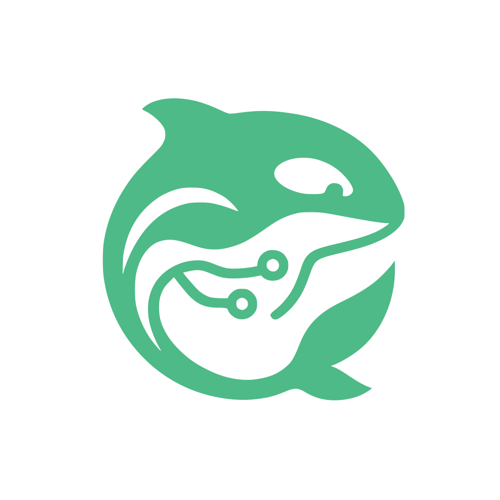

<p align="center">
  
</p>

<h1 align="center">Keiko for Quality</h1>

<p align="center">
  Model-backed code review, published as native pull-request conversations.<br>
  It reads content, writes review comments, and nothing else.
</p>

<p align="center">
  <a href="https://github.com/oscharko-dev/Keiko-for-Quality/pulls?q=is%3Apr"></a>
  <!-- Live widget, enabled once quality.keiko.dev is deployed (design-system/index.html, section 07):
  <a href="https://github.com/oscharko-dev/Keiko-for-Quality/pulls?q=is%3Apr"></a>
  -->
</p>

<p align="center">
  <sub>This repository reviews itself: every non-draft, same-repository pull request here is
  reviewed by Keiko for Quality before it merges.</sub>
</p>

---

## What it does

Keiko for Quality reviews every non-draft pull request from the same repository (fork-originated
heads are deliberately skipped — see the trust posture) against its base branch and publishes
what it finds as ordinary review conversations — anchored to the file and line, bound to the
exact commit it reviewed. You reply, resolve or refute them the way you would with any reviewer.

Every run leaves one **run summary** comment: outcome, path accounting, findings published,
duplicates suppressed, budget spent — counts only, maintained in place, with a bounded trail of
recent runs.

**It is honest about coverage.** A run that could not review everything says so, names a reason
code, and tells you to treat the change as unreviewed. Incomplete never reads as clean; absent
numbers are omitted, never shown as zero.

## What it will never do

No pushes. No commits. No merges. No approvals. The App's permissions make this structural,
not a promise — see [SECURITY.md](SECURITY.md).

## How a finding reads

Each finding opens with its classification, makes one imperative claim, and argues it in two
sentences a reader can check against the code:

> **TESTS · MAJOR**
>
> **Add the required `verifyImmutableOwnership` option to the activation call.**
>
> When the unsigned-install waiver test invokes `activateMacosPortableRuntime`, it omits the
> callback the function expects — a compile error or a runtime `undefined` callback.

A collapsed _Prompt for AI agents_ block carries a repair instruction for whichever agent picks
it up — including the licence to decline: verify against the current code, and if the finding no
longer applies, reply with a reason instead of changing anything.

| Severity | Meaning                           |
| -------- | --------------------------------- |
| Critical | exploitable, corrupting, blocking |
| Major    | wrong behaviour, real cost        |
| Minor    | worth fixing, not urgent          |
| Nit      | style, naming, taste              |

Categories: security · correctness · performance · maintainability · tests · documentation.
Findings that restate an open conversation, a resolved disposition, or another finding in the
same run are suppressed — the accounting for every suppression is in the run summary.

## Getting started

1. Create the GitHub App for your installation (see
   [docs/operations.md](docs/operations.md) for permissions and the trust posture), or install
   an existing one.
2. Add the workflow. The shape below is the trust model, not boilerplate: the runner checks out
   the **trusted base**, fetches the candidate head as Git objects only, and passes the model
   credential by variable name:

   ```yaml
   # .github/workflows/keiko-for-quality.yml
   on:
     pull_request:
       types: [opened, synchronize, reopened, ready_for_review]

   permissions:
     contents: read

   jobs:
     review:
       runs-on: ubuntu-latest
       timeout-minutes: 30
       steps:
         # Check out the TRUSTED BASE, never the candidate head. The head is fetched as Git
         # objects only, so its content is readable but never materialized on the filesystem.
         - uses: actions/checkout@<sha> # v7.0.0
           with:
             ref: ${{ github.event.pull_request.base.sha }}
             fetch-depth: 0
             persist-credentials: false

         - name: Fetch candidate head as objects
           env:
             PR: ${{ github.event.pull_request.number }}
           run: git fetch --no-tags origin "pull/${PR}/head"

         - uses: oscharko-dev/Keiko-for-Quality@<sha> # v0.20.1
           env:
             # The credential is passed by variable NAME, never as an input.
             KFQ_MODEL_TOKEN: ${{ secrets.KFQ_MODEL_TOKEN }}
           with:
             profile: .github/keiko-for-quality.json
             model_endpoint: https://api.anthropic.com
             model_id: claude-sonnet-5
             model_protocol: anthropic
             model_token_env: KFQ_MODEL_TOKEN
             app_id: ${{ secrets.KFQ_APP_ID }}
             app_private_key: ${{ secrets.KFQ_APP_PRIVATE_KEY }}
             target_branches: dev
   ```

   Reference the action at a **full 40-character commit SHA**. A tag is mutable, and the whole
   trust model rests on the executed code being immutable.

3. Declare your review profile — the set of review-relevant paths is yours to declare, not the
   reviewer's to assume. Start from
   [`examples/review-profile.json`](examples/review-profile.json).
4. Open a pull request. The first run reviews it, publishes its findings, and leaves the run
   summary.

The full operating reference — every input, local runs, report schemas, the qualification gates —
is in [docs/operations.md](docs/operations.md); release discipline is in
[CONTRIBUTING.md](CONTRIBUTING.md).

## Where findings reach you

- **On the pull request** — findings and the run summary, as conversations.
- **In CI and scripts** — the local CLI (`npm run review`) prints the run and writes JSON or
  SARIF reports; see [docs/operations.md](docs/operations.md#local-runs).
- **Roadmap** — an email digest per run (templates already in
  [`design-system/email/`](design-system/email/)) and JetBrains/VS Code plugins showing the
  same findings at the line.

## Design system

The complete design language for every surface — GitHub comments, email, CLI, checks and README
widgets — lives in [`design-system/`](design-system/): one self-contained page
(`index.html`), the Lift-grammar quality glyphs, and the orca marks. Comment assets are pinned
to the full commit SHA that the [`kq-assets-v1`](.github/assets/kq/) tag names — the SHA, not
the tag, for the same reason consumers pin this action by SHA — so published comments can never
change appearance retroactively.

## Governance

The reviewer's whole vocabulary about a run is a closed set of reason codes — no free-form
text leaves your repository in diagnostics. Model output is sanitized before publication and
can never carry markup. What the engine read, what it spent and what it withheld is on the
run summary, per run.

---

<p align="center">
  <sub>Part of <a href="https://github.com/oscharko-dev/Keiko">Keiko</a> — ex experientia disco.</sub>
</p>
